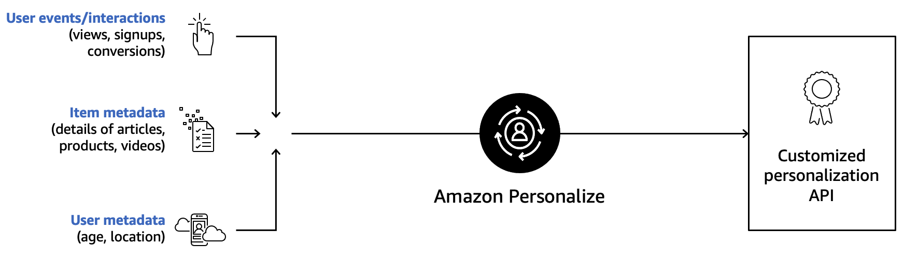

# Get to know Amazon Personalize

Amazon Personalize is a fully managed machine learning service that uses your data to generate item recommendations for your users. 

It can also generate user segments based on the users' affinity for certain items or item metadata.

## Amazon Personalize key benefits 

### Value-added features that go beyond basic ML practices 
Personalization that moves the needle on key business outcomes is key. Amazon Personalize is a fully managed ML service that goes beyond the core ML modeling process to allow you to tune recommendations and include features such as: 

1. Allowing users to filter items/content based on past interactions and item information. For example, filter out recently watched items, highlight a specific brand or trending news, ensure there is no explicit content in family viewing categories, or have a bias towards specific items.

2. Optimize for any type of business metric that is important to your business (profit, revenue, watch time, etc.).

### Respond quickly to changing user intent using real-time recommendations
Amazon Personalize provides flexibility to use real-time or batch data based on what is most appropriate for your use case. For example, recommendations can be served across web pages in real-time to quickly respond to changing user intent, whereas batch recommendations may be more appropriate for large email campaigns.

### Automate steps to reduce time to market
The service automates and manages the lifecycle for many of the complicated steps required to build, train, and deploy a machine learning model, reducing deployment costs and time to days, not weeks or months. 

### Integrate seamlessly with existing systems
Amazon Personalize APIs integrate seamlessly into your tech stack/business process. You can apply the recommendations across your website, applications, marketing emails, push notifications, advertising campaigns, and more, eliminating high infrastructure and resource costs. Amazon Personalize is not a SaaS solution which requires a heavier lift and is more complex to integrate. 

### Encrypted to be private and secure
With AWS, you inherit the latest, and most comprehensive security and compliance controls, strengthening your own compliance and certification programs. All of your data is encrypted to be private and secure, and is only used to create recommendations for your users. All models are private and custom and we do not share data between customers or with Amazon Retail. 

## How it works

Amazon Personalize is a fully managed machine learning service that goes beyond rigid static rule based recommendation systems and trains, tunes, and deploys custom ML models to deliver highly personalized recommendations. It provisions the necessary infrastructure and manages the entire ML pipeline, including processing the data, identifying features, and training, tuning, optimizing, and hosting the models.

You start by providing data about your users and items to Personalize; the data we use for modeling on Personalize is of three types 

(a) The activity of your users, also known as events or behavioral interaction data. Examples include items your users are clicking on, browsing, reading, watching, or purchasing. This dataset has the strongest signal for our machine learning algorithms and is the only one mandatory for Amazon Personalize.

(b) The second kind of dataset, item metadata, includes details about your items, such as category, size, genre, description, or brand…essentially the information already in your item catalog. This dataset is optional but very useful for scenarios such as coldstart, when we want to make recommendations on new items.

(c) The third dataset, user metadata, includes details about your customers, often demographics, like their location, age, or subscription tier. Now once you have the data into the Service you can, in just a few clicks, get a custom, private personalization model trained and hosted for you. You can then retrieve those personalized recommendations for your users through a private API.

## Additional resources

* [Product Page](https://aws.amazon.com/personalize/)
* [GitHub Sample Notebooks](https://github.com/aws-samples/amazon-personalize-samples)
* [Product Documentation](https://docs.aws.amazon.com/personalize/latest/dg/what-is-personalize.html)

The content in the Notebooks is designed to help you build out your first models for your given use case. Now lets head to the first notebook [01_Data_Layer.ipynb](./01_Data_Layer.ipynb)